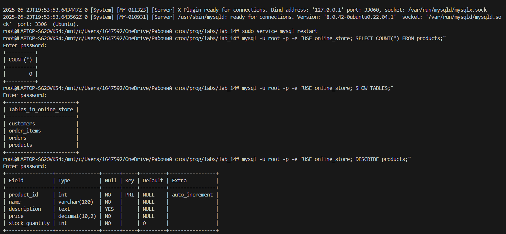
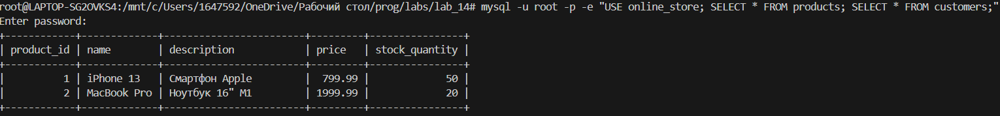
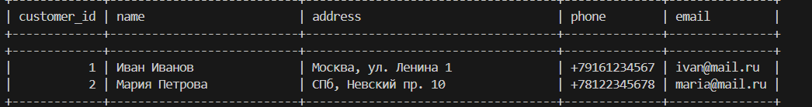

# Лабораторная работа №14
# Задание

Спроектируйте БД с использованием crow’s foot notation.  
Создайте таблицы БД и заполните данными. Для генерации данных можно использовать сервис https://www.mockaroo.com/.  
Напишите несколько запросов для выборки данных из всех таблиц.  
 
## Вариант 3
**База данных онлайн-магазина:**
1. Таблица Товары содержит информацию о продаваемых товарах, такую как название, описание, цена и количество на складе.
2. Таблица Заказы содержит информацию о заказах, включая дату заказа, статус заказа и связанные с ним товары.
3. Таблица Покупатели содержит информацию о покупателях, такую как их имена, адреса доставки и контактные данные.

# Вывод
1. В таблицу были добавлены тестовые значения, а именно покупатели, товары и цены.
  
  
  
## Как можно менять таблицу?
1. Добавить новый товар:  
`mysql -u root -p -e "USE online_store;`     
`INSERT INTO products (name, description, price, stock_quantity)   `  
`VALUES ('Новый товар', 'Описание', 500.00, 25);"`
2. Найти товары дороже N руб  
`mysql -u root -p -e "USE online_store; `  
`SELECT * FROM products WHERE price > N;"`
